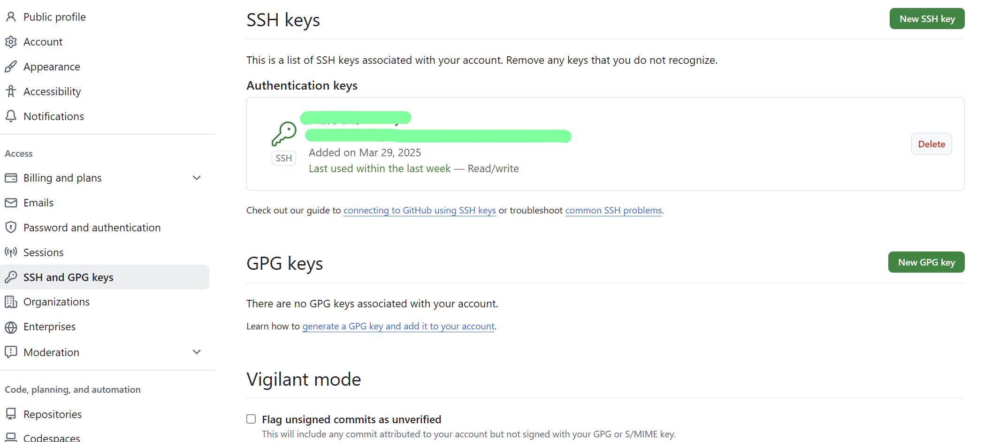

### 学习Git知识

#### 将项目上传到Github的空仓库

##### 前置准备

1. 给git设置全局用户名和邮件地址（设置提交代码的用户信息，不一定要和Github上的一样）

   - 设置用户名

     ```bash
     git config --global user.name "用户名"
     ```

   - 设置邮件地址

     ```bash
     git config --global user.email "邮件地址"
     ```

2. 查看设置是否生效

   ```bash
   git config -l
   ```

3. 配置公钥连接Github

   - 生成ssh公钥 ssh-keygen -t rsa -C "你的邮件地址"

     ```bash
     ssh-keygen -t rsa -C "邮件地址"
     ```

   - 将生成的公钥设置到Github

     

##### git项目到github仓库

1. 在本地项目根目录初始化本地git仓库

   ```bash
   git init
   ```

2. 将想到git的文件添加到本地仓库

   ```bash
   # 添加README.md文件到本地仓库
   git add README.md
   ```

3. 提交变更的文件

   ```bash
   # m的意思是message
   git commit -m "第一次提交"
   ```

4. 修改当前分支名字

   ```bash
   # git默认的分支是叫master，我们把它改成main
   git branch -m main
   ```

5. 关联远程仓库地址

   ```bash
   # 这里的地址要使用ssh地址，不可以用https地址，因为我们是用ssh密钥设置的用户认证
   git remote add origin git@github.com:hcat0616/learnGit.git
   ```

6. 将本地仓库变更的文件提交到远程仓库

   ```bash
   # 如果远程仓库是没有任何文件的我们就直接这样
   git push -u origin main
   # 如果远程仓库有文件（比如 README.md）,那我们就需要先把README.md文件拉下来
   git pull -u origin main --allow-unrelated-histories
   git push -u origin main
   
   # 因为我们用 -u 指定了分支，下次我们push和pull就非常简单了
   git push
   git pull
   ```

   
